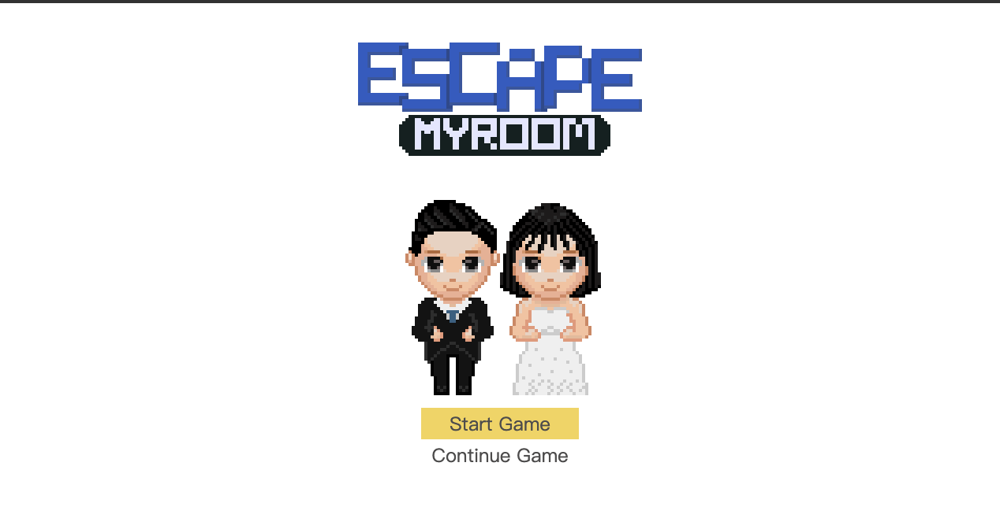

# 婚禮邀請函小遊戲

## 專案目的
本專案目的為透過將婚禮資訊藏於謎題中的方式，協助賓客在遊戲過程中確認各項婚禮資訊。

## 安裝
若欲執行本專案，需於本機安裝node.js執行環境。接著便可執行套件安裝指令
```
npm install
```

## 執行
安裝完成後執行
```
npm start
```
即可於`localhost:8080`執行此小遊戲。

## 遊戲控制
除了對話視窗可以透過Enter進行下一步之外，遊戲全程以滑鼠點擊方式進行。點擊畫面各處尋找線索並解出最終密碼即可完成通關。

畫面右上角設有提示按鈕，每道關卡有三層提示可以協助卡關的玩家。

## 授權
本專案使用MIT授權。

---
⚠️ Please note: The current version of this game is only available in Traditional Chinese.
# Wedding Invitation Mini-Game


## Project Purpose
The purpose of this project is to help guests confirm various wedding details through a game process where wedding information is hidden in riddles.

## Installation
If you wish to run this project, you need to install the node.js runtime environment on your machine. You can then run the package installation command:
```
npm install
```
## Execution
After the installation is complete, execute:
```
npm start
```
You can then run this mini-game at localhost:8080.

## Game Controls
Apart from advancing the dialogue window by pressing Enter, the game is entirely mouse-controlled. Click on various parts of the screen to find clues and decipher the final password to complete the game.

There is a hint button at the top right corner of the screen. Each level has three hints to assist players who are stuck.

## License
This project is licensed under the MIT License.